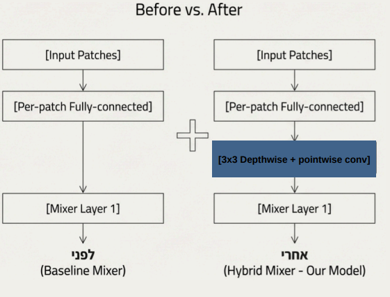
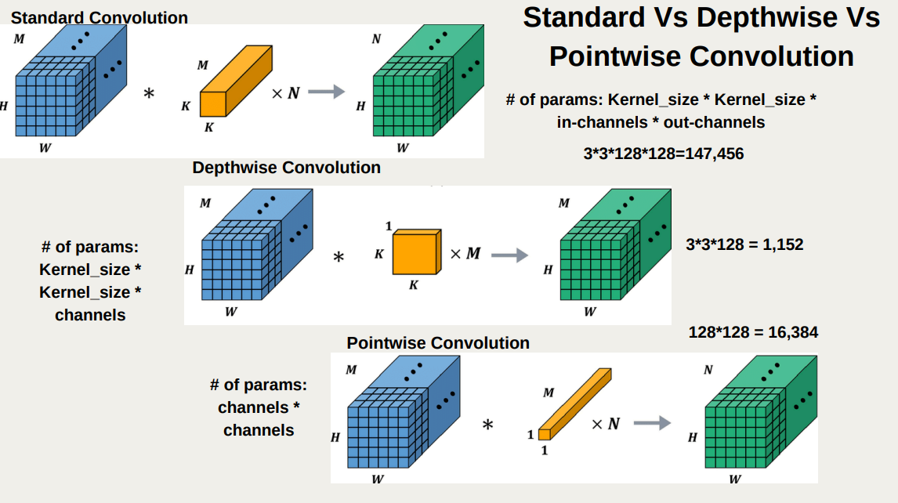
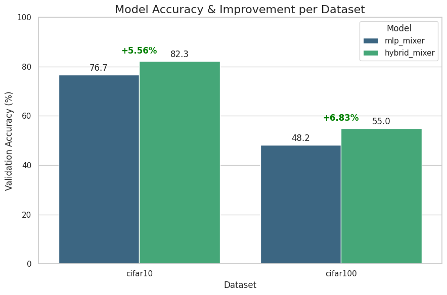

# Improving MLP-Mixer Performance on Small Image Datasets

This repository contains the PyTorch implementation of a **Hybrid MLP-Mixer** architecture designed to bridge the gap between MLPs and CNNs on small datasets.

## 📌 Project Overview
The standard **MLP-Mixer** architecture relies entirely on matrix multiplications, lacking the built-in spatial inductive bias (locality) found in CNNs. While it achieves state-of-the-art results on massive datasets (e.g., JFT-300M), it struggles to generalize on smaller benchmarks like CIFAR-10 and CIFAR-100, often leading to overfitting.

**Our Solution:** We introduce a **Hybrid Convolutional Stem**—a lightweight block inserted immediately after patch embedding. This block uses a $3\times3$ Depthwise Convolution followed by a $1\times1$ Pointwise Convolution to "smooth" patch representations and inject local spatial awareness before global mixing begins.

### Architecture Comparison

*Left: Standard MLP-Mixer. Right: Our Hybrid Mixer with the added convolutional stem.*

## 🚀 Key Features
* **Hybrid Architecture:** Combines the efficiency of MLPs with the local feature extraction of CNNs.
* **Minimal Overhead:** The added stem uses Depthwise Separable Convolutions, adding only ~17.5k parameters (vs ~147k for a standard convolution).
* **Plug-and-Play:** The modification preserves the token count and dimensionality, making it compatible with existing Mixer blocks.

### Efficiency Mechanism

*Visualizing the parameter efficiency of our Depthwise Separable approach.*

## 📊 Results
We evaluated the model on **CIFAR-10** and **CIFAR-100**. The Hybrid Mixer demonstrates faster convergence and superior generalization compared to the baseline MLP-Mixer.

| Dataset | Baseline Accuracy | Hybrid (Ours) Accuracy | Improvement |
| :--- | :--- | :--- | :--- |
| **CIFAR-10** | 76.71% | **82.27%** | **+5.56%** |
| **CIFAR-100** | 48.20% | **55.03%** | **+6.83%** |



## 🛠️ Usage
To train the model on CIFAR-10:
```bash
python train.py --dataset cifar10 --model hybrid_mixer --epochs 30
